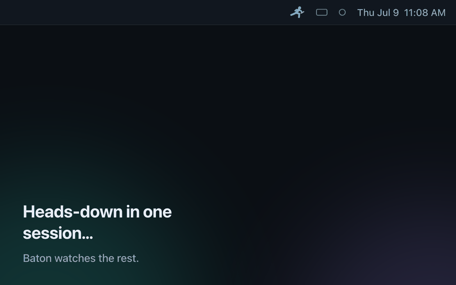
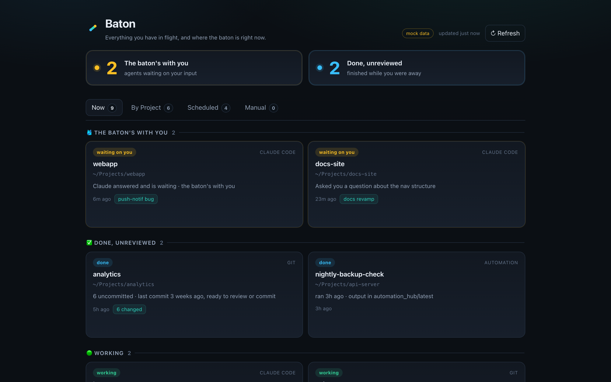

<p align="center">
  
</p>

<p align="center">
  
  
  
  <a href="LICENSE"></a>
</p>

**A local command center for every AI agent you have in flight.** Claude Code sessions and
Codex threads, in one glance, so you always know *which one needs you right now*.

As agents do more work unattended, the hard part stops being *doing the work* and becomes
*knowing which of your N running things is waiting on a decision*. Baton reads the signals your
machine already emits (zero manual entry) and surfaces the one that matters: the
**🎽 "the baton's with you"** bucket, an agent that ran its leg and handed back to you. That's
the thing that's easy to drop when you're looking elsewhere.

It lives in your **macOS menu bar** (a relay runner + "N batons for you"); click for the full
picture, click any session to **jump straight to it**.

<p align="center">
  
</p>

## Install

```bash
curl -fsSL https://raw.githubusercontent.com/neilkpatel/baton/main/install.sh | bash
```

That clones Baton into `~/.baton`, sets up an isolated Python venv (the only deps are `rumps`
and the FSEvents binding), and installs a login LaunchAgent. The 🎽 appears in your menu bar
immediately, starts at login, and relaunches if it crashes.

Prefer to look first? Clone and run the same script from the checkout:

```bash
git clone https://github.com/neilkpatel/baton.git && cd baton
bash install.sh                  # or: bash install.sh --no-autostart
```

**Update:** re-run the same one-liner. It pulls the latest into `~/.baton` and restarts the app.
Remove the autostart anytime with `bash install.sh --uninstall`.

**Requirements:** macOS, Python 3.9+ (3.11+ enables Codex scheduled-automation tracking), and
Claude Code and/or Codex. Baton shows whatever it finds; either alone is fine.

## What it does

- **Menu bar glance:** the title is a live count of sessions waiting on you. Always visible,
  updates in **under a second** (it *watches* your session files with FSEvents rather than
  polling, so it's both instant and battery-cheap; it idles until something actually changes).
- **Two agents, one view:** the dropdown groups what's waiting by tool (Claude Code / Codex),
  then Working, then Done.
- **Click to jump:** click a Claude session and its **Terminal.app tab** comes to the front;
  click a Codex thread and it opens in **Codex** via its `codex://` deep link. No more hunting
  through windows.
- **Accurate "waiting" signals, per tool:**
  - **Claude Code:** a session that's idle with an assistant answer as its last turn = waiting.
  - **Codex:** mirrors Codex's own **unread (blue-dot)** state, so a thread you've already
    opened doesn't nag you.
- **Click-to-acknowledge:** jumping to a waiting session clears it from the count until it
  produces a *new* answer, and the session you currently have open in Terminal isn't counted
  while you're looking at it. The number goes down when you deal with things.
- **Optional hand-off notifications:** off by default (the menu bar is the calm channel); one
  toggle turns on a banner the moment a baton comes back.
- **Recognizable labels:** each session is titled by Claude Code's own running summary
  (`ai-title`), so you know what it's about at a glance.

## The dashboard

There's also a full HTML dashboard (`server.py` + `index.html`) for the rich multi-tab view.
Open it from the dropdown ("Open full dashboard →"), or:

```bash
bash start.sh        # python3 server.py --port 8787  → http://127.0.0.1:8787
```

<p align="center">
  
</p>

## How it works

Every source is a **collector** that normalizes into one `track` record, so the UI never changes
as sources are added:

```
{ id, source, title, project, status, lastActive, detail, alive, extras }
status ∈ waiting | working | done | idle | scheduled
```

| Source | Read from | Signal |
|---|---|---|
| **Claude Code** | `~/.claude/sessions/{pid}.json` + transcripts | live `busy`/`idle` + last turn → working vs **waiting-on-you** |
| **Codex threads** | `~/.codex/session_index.jsonl` + `.codex-global-state.json` | **unread (blue-dot)** → waiting; rollout transcript → the agent's closing line |
| **Codex automations** | `~/.codex/automations/*/automation.toml` | scheduled pipelines → next/last run |

Claude Code (`~/.claude`) and Codex (`~/.codex`) are separate tools with separate state dirs;
Baton reads both independently. Detection is **event-driven** (FSEvents on the session dir) with
a slow safety-net poll.

## Stack

Single-file collectors + menu bar app in **stdlib Python** (plus `rumps` for the menu bar and
`pyobjc-framework-FSEvents` for the watcher, in an isolated `.venv`). The dashboard is
dependency-free vanilla HTML/CSS/JS. No build step, no framework.

## Known limitations

- **Click-to-jump raises Terminal.app tabs only.** If you run Claude Code in iTerm, Ghostty, or
  another terminal, detection and counts still work fine; clicking a Claude session just can't
  raise your tab yet (it opens the dashboard instead). Codex jumps work regardless, via deep link.
- **Claude Code has no native read/unread flag** (Codex does, and Baton mirrors it directly).
  For Claude, "waiting" clears when you view the session's Terminal tab, click it in Baton, or
  hit "Mark all as seen", and it comes back when the session produces a new answer.
- **macOS only** by nature: FSEvents watcher, menu bar app, AppleScript jump.

## Security & privacy

Entirely local and strictly read-only over `~/.claude` and `~/.codex`: Baton never mutates your
session state, and nothing leaves your machine. The live payload contains your real prompts and
working directories, so the dashboard server **binds to `127.0.0.1` only**, never `0.0.0.0`.
Captured state (`state.json`) is git-ignored; only scrubbed sample data is committed.

## Files

`menubar.py` (the app) · `collectors.py` (the signal readers) · `server.py` + `index.html`
(dashboard) · `install.sh` · `start.sh` · `requirements.txt` · `state.example.json` (the
`track` contract).

## License

[MIT](LICENSE)
